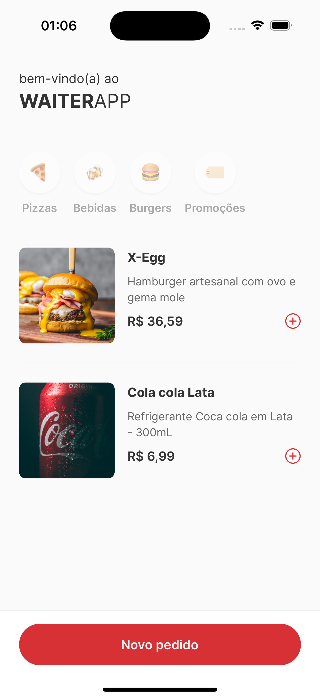

# 🍽️ WaiterApp

> Um aplicativo mobile moderno para garçons e restaurantes, desenvolvido com React Native e Expo

## 📱 Preview

<div align="center">
  
</div>

## 📱 Sobre o Projeto

O **WaiterApp** é uma aplicação mobile desenvolvida para facilitar o trabalho de garçons e melhorar a experiência em restaurantes. Com uma interface intuitiva e moderna, o app permite gerenciar pedidos, mesas e comunicação entre a cozinha e o salão de forma eficiente.

## 🚀 Tecnologias Utilizadas

### 🛠️ Core
- **React Native** `0.79.5` - Framework para desenvolvimento mobile
- **Expo** `~53.0.20` - Plataforma para desenvolvimento React Native
- **TypeScript** `~5.8.3` - Superset JavaScript com tipagem estática

### 🎨 UI/UX
- **NativeWind** `^4.1.23` - Tailwind CSS para React Native
- **TailwindCSS** `^3.4.17` - Framework CSS utilitário
- **Lucide React Native** `^0.536.0` - Biblioteca de ícones
- **Inter Font** - Fonte moderna e legível

### 🔧 Ferramentas de Desenvolvimento
- **Biome** `2.1.2` - Linter e formatter
- **Husky** `^9.1.7` - Git hooks
- **Commitlint** `^19.8.1` - Padronização de commits
- **React Native Reanimated** `~3.17.4` - Animações performáticas

### 📦 Utilitários
- **clsx** `^2.1.1` - Utilitário para classes condicionais
- **React Native SVG** - Suporte para SVGs
- **Safe Area Context** - Gerenciamento de áreas seguras

## 📋 Pré-requisitos

Antes de começar, certifique-se de ter instalado:

- **Node.js** (versão 18 ou superior)
- **Yarn** ou **npm**
- **Expo CLI**
- **Android Studio** (para Android) ou **Xcode** (para iOS)

## 🚀 Como Rodar o Projeto

### 1️⃣ Clone o repositório
```bash
git clone <url-do-repositorio>
cd waiterapp/app
```

### 2️⃣ Instale as dependências
```bash
yarn install
# ou
npm install
```

### 3️⃣ Inicie o projeto
```bash
# Iniciar o servidor de desenvolvimento
yarn start
# ou
npm start

# Para rodar diretamente no Android
yarn android
# ou
npm run android

# Para rodar diretamente no iOS
yarn ios
# ou
npm run ios

# Para rodar no navegador (web)
yarn web
# ou
npm run web
```

### 4️⃣ Abra o app
- **Expo Go**: Escaneie o QR code que aparece no terminal
- **Emulador**: O app abrirá automaticamente no emulador configurado
- **Dispositivo físico**: Use o Expo Go ou build nativo

## 📁 Estrutura do Projeto

```
app/
├── src/
│   ├── app/           # Aplicação principal (index.tsx)
│   ├── assets/        # Recursos estáticos (estilos globais)
│   ├── modules/       # Módulos da aplicação
│   │   ├── categories/    # Gerenciamento de categorias
│   │   ├── orders/        # Sistema de pedidos e mesas
│   │   ├── products/      # Catálogo de produtos
│   │   └── shared/        # Componentes e utilitários compartilhados
│   └── screens/       # Telas da aplicação (HomeScreen)
├── assets/            # Assets do Expo (ícones, splash, preview)
├── mocks/            # Dados mockados para desenvolvimento
└── ...               # Arquivos de configuração
```

## 🎯 Funcionalidades

- 📋 **Gerenciamento de Pedidos** - Sistema completo de criação e controle de pedidos
- 🍽️ **Controle de Mesas** - Modal para seleção e gerenciamento de mesas
- 🏷️ **Categorias de Produtos** - Filtros por categorias (Pizzas, Bebidas, Burgers, Promoções)
- 🍔 **Catálogo de Produtos** - Lista completa de produtos com preços e descrições
- 👨‍🍳 **Comunicação com Cozinha** - Interface para envio de pedidos
- 📱 **Interface Responsiva** - Design adaptado para diferentes dispositivos
- 🎨 **Design Moderno** - UI/UX com NativeWind (Tailwind CSS)
- 🔤 **Tipografia Personalizada** - Fonte Inter com múltiplos pesos
- 🌐 **Internacionalização** - Suporte para localização pt-BR

## 🔧 Scripts Disponíveis

- `yarn start` - Inicia o servidor de desenvolvimento
- `yarn android` - Roda no Android
- `yarn ios` - Roda no iOS
- `yarn web` - Roda no navegador

## 🤝 Contribuição

1. Faça um fork do projeto
2. Crie uma branch para sua feature (`git checkout -b feature/AmazingFeature`)
3. Commit suas mudanças (`git commit -m 'Add some AmazingFeature'`)
4. Push para a branch (`git push origin feature/AmazingFeature`)
5. Abra um Pull Request

## 📝 Licença

Este projeto está sob a licença MIT. Veja o arquivo `LICENSE` para mais detalhes.

---

⭐ **Desenvolvido com ❤️ para revolucionar a experiência gastronômica!**
